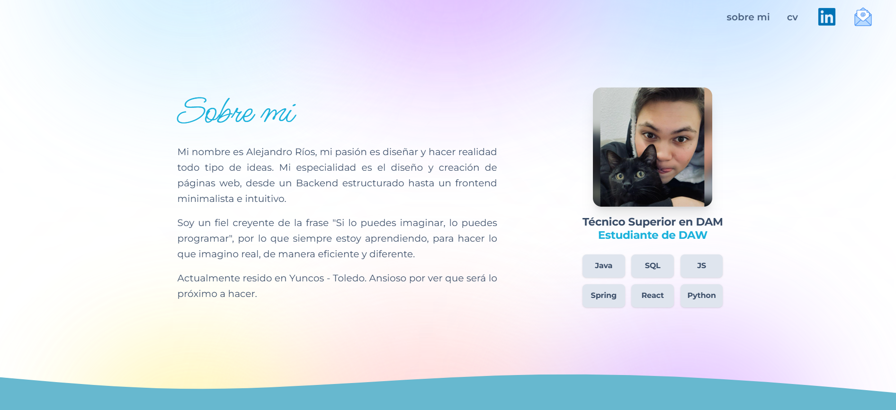
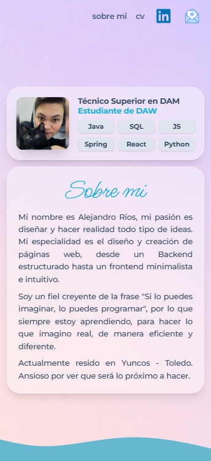

# 🚀 Portfolio Web Personal - Alejandro Ríos

## 📖 Descripción del Proyecto
[cite_start]Este repositorio contiene el código fuente de mi Portfolio Intermodular para el ciclo de Desarrollo de Aplicaciones Web (DAW)[cite: 1, 39]. Es una *Landing Page* vanguardista diseñada bajo el enfoque *mobile-first*, que utiliza animaciones complejas de scroll para crear una experiencia inmersiva e interactiva.

## 🔗 Enlaces Importantes
* [cite_start]**🎨 Prototipo en Figma (Sistema de Diseño y UI):** [Pega aquí el enlace a tu Figma] [cite: 43]
* [cite_start]**🌐 Web Publicada (GitHub Pages):** [Pega aquí el enlace de tu web una vez publicada] [cite: 44]

## 💻 Tecnologías Utilizadas
* **HTML5:** Estructuración semántica y accesible.
* [cite_start]**Tailwind CSS v4:** Maquetación responsiva, *glassmorphism* (efecto cristal) y variables personalizadas compiladas para producción[cite: 36, 37].
* **JavaScript (Vanilla):** Lógica del DOM y control de eventos.
* **GSAP & ScrollTrigger:** Motor de animaciones inmersivas basadas en el scroll del usuario (efecto pin y zoom de ventanas).

## 📸 Capturas del Sitio Web Publicado
[cite_start]*(A continuación se muestra cómo se visualiza el diseño en diferentes dispositivos)* [cite: 47]

> **Nota:** Para que las imágenes se vean, guarda unas capturas de tu web terminada en una carpeta llamada `assets` y cambia las rutas de abajo por los nombres de tus imágenes.

 

## 📚 Bibliografía y Referencias
[cite_start]Durante la fase de diseño y desarrollo, se consultaron los siguientes recursos[cite: 48, 49]:
* [cite_start]**Diseño y Figma:** Tutoriales sobre creación de sistemas de diseño, variables, tokens y paletas de colores[cite: 51, 53].
* [cite_start]**Inspiración:** Ejemplos de portfolios de desarrolladores web[cite: 59, 61].
* **Desarrollo Frontend:**
  * [cite_start]Documentación de Tailwind CSS (Diseño responsivo y variables)[cite: 57, 58].
  * Documentación de GSAP (GreenSock Animation Platform).
* [cite_start]**Despliegue:** Documentación oficial para desplegar sitios estáticos con GitHub Pages[cite: 66].